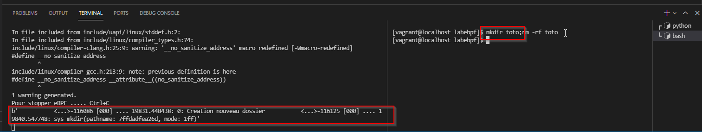

# Labebpf

## Installation bcc-tools.
En supposant que vous soyez bien comme le prévoit le Lab connecté via VSStudio sur une instance Centos8 (noyau 4.18; uname -a pour vérifier), lancer les commandes suivantes:

Installation de Python3 et création d'un lien symbolique pour les scripts BCC

```
sudo dnf install -y python3
sudo ln -s /usr/bin/python3 /usr/bin/python
```

puis installation des bcc-tools et clone du repo de code associé pour directement tester les exemples

```sudo dnf -y install bcc-tools 
git clone https://github.com/iovisor/bcc.git
```

Lancer l'exemple suivant :

```
sudo bcc/examples/hello_world.py
```

Si tout se passe bien vous devriez voir quelque chose comme ça (affichage d'un message pour les différents process créés; pas de soucis ceux-ci sont probablement lié au server VSCode installé dans la VM)


Ok, vous vous en doutez probablement, mais vous venez d'exécuter votre premier programme eBPF avec BCC.

# Lab 1

Si sur CentOS/7 la manipulation n'était pas nécessaire, sur CentOS/8 elle semble l'être pour que le programme ci-dessus fonctionne 

```
cat 1 > /sys/kernel/debug/tracing/events/syscalls/sys_enter_mkdir/enable
```

Executer le script directoryCreate.py dans un second terminal et vous devriez obtenir ceci :



Il n'est pas facile de savoir à quelle event attacher sa probe (en effet les traitements enregsitrent ces probes dynamiquement sur le système).
Néanmoins un sous-ensemble de celles qui sont disponible sur le système sont consultables ici :
* /sys/kernel/debug/tracing/available_filter_functions

On pourra aussi trouver la liste des kprobes actives sur le système en consultant le contenu de ce fichier :
* /sys/kernel/debug/tracing/kprobe_events

Enfin, il faut s'assurer que celle qu'on cherche à suivre n'est pas blacklisté. A consulter dans :
* /sys/kernel/debug/kprobes/blacklists

# Lab 2
On ajout un timestamp en sortie en utilisant le deuxième mécanisme de communication avec le User space (le BPF_PERF_OUTPUT)

On définit cette fois la structure suivante dans le code C et un canal nommé "events"

```
struct timestamp_mkdir_class{
    u64 timestamp_mkdir;
};

// Create a channel in PERF BUFFER
BPF_PERF_OUTPUT(events);
```

On référencera ce canal pour récupérer les informations issues de la fonction eBPF depuis le code python :

```
b["events"].open_perf_buffer(afficher_evenement)
```

Dans le code C on initialise ensuite la structure, puis on appelle une fonction fournie par bcc pour récupérer le timestamp système (cf. https://github.com/iovisor/bcc/blob/master/docs/reference_guide.md: cf. pas très utile)
On soumet ensuite cette structure dans le canal "events"

Côté Python on récupère la structure C qu'on caste vers un structure python (en utilisant la librairie ctypes et les tables de conversion suivante : https://docs.python.org/2/library/ctypes.html#fundamental-data-types)

# Lab 3
On commence par définir la MAP

```
BPF_HASH(compteur); // equivalent to BPF_HASH(compteur, u64);
```

A noter que le second paramètre correspond au type de la clé de la map (peut être une chaine). Par dégfaut, c'est u64.

Ce qu'on fait ici :

```
	u64 index_compteur = 0;	// index variable to access compteur elements
	u64 *compteur_pointeur;// to read content of element chosen with index_compteur
    u64 nouveauCompteur=1; // to update content of element chosen with index_compteur
    compteur_pointeur = compteur.lookup(&index_compteur);

    nouveauCompteur = *compteur_pointeur + 1;
    bpf_trace_printk("Nombre de dossier(s) : %d\\n", nouveauCompteur);
    compteur.delete(&index_compteur);
        
	compteur.update(&index_compteur, &nouveauCompteur);
	return 0; // always return 
```
On lit la donnée à la clé d'index 0. L'adresse de la valeur est copié dans le pointeur compteur_pointeur.
On incrément 1 à la valeur récupérée et on affiche le nouveau compteur.

On supprime l'ancien compteur et on met à jour la MAP (index 0) avec la nouvelle valeur
